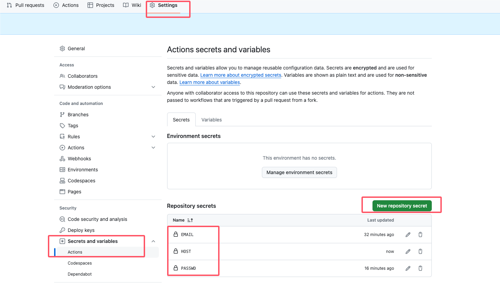

# SSPanel-Auto
实现SSPanel框架搭建的平台流量自动签到功能,windows,mac,linux 都可以使用

## 相关说明 
适用于使用 SSPanel 用户管理面板搭建的网站，网站页面底部会有 `Powered by SSPANEL` 字段  
登录页面张这个样子


# 使用方式

## 推荐使用github action 每天自动运行,无需执行环境,简单快速0成本

### 自动签到
1. fork 仓库代码到自己仓库
2. 把email和passwd添加到仓库的`secrets`中,[使用指南](https://docs.github.com/zh/actions/security-guides/using-secrets-in-github-actions#creating-secrets-for-a-repository)  

     

3. 进入Actions，执行一次`AutoCheckin`工作流。(因为 Github 默认 Fork 后的项目 Github Actions 处于关闭状态)


## 本地执行
[下载可执行文件](https://github.com/linabellbiu/SSPanel-Auto/releases)  
命令参数
```
Usage:
  SSPanel-Auto [flags]
  SSPanel-Auto [command]

Available Commands:
  checkin     执行签到功能
  completion  Generate the autocompletion script for the specified shell
  help        Help about any command
  reg         执行注册功能

Flags:
  -h, --help           help for SSPanel-Auto
  -H, --host string    需要访问的域名 例如: http://wwww.xxx.com (必填)
  -x, --proxy string   设置http代理 例如: 127.0.0.1:7890

```
### 自动签到
参数
```
Usage:
  SSPanel-Auto checkin [flags]

Flags:
      --cron string     设置每天定时执行,只用在本地执行,如果是放在github action中要关闭这个选项.
                        配合'cron_disable'指令打开此功能 (default "1 0 0 * * *")
      --cron_disable    关闭次指令后,可以使用'cron'设置定时执行 (default true)
  -e, --email string    账户名,注册的邮箱账号 (必填)
  -h, --help            help for checkin
  -p, --passwd string   密码,注册的密码 (必填)
      --try int         请求失败重试次数 (default 3)
```

```shell
./SSPanel-Auto -H https://www.xxxx.com/ checkin -e xxx@gmail.com -p 123456 --cron_disable=false
```

### 自动注册
参数
```
Usage:
  SSPanel-Auto reg [flags]

Flags:
      --code string    邀请码,填写才能反流量 (必填)
      --count int      每次注册的数量,不要设置太大 (default 3)
      --cron string    设置每天定时执行,只用在本地执行,如果是放在github action中要关闭这个选项.
                       配合'cron_disable'指令打开此功能 (default "1 0 0 * * *")
      --cron_disable   关闭次指令后,可以使用'cron'设置定时执行 (default true)
  -h, --help           help for reg
      --try int        请求失败重试次数 (default 3)

```

```shell
./SSPanel-Auto  -H https://www.xxx.com/ reg --code thfJ
```

## 如果运行在国内,请求访问失败可能需要配置科学上网
```shell
./SSPanel-Auto [flag] -x 127.0.0.1 [command] [flag]
```